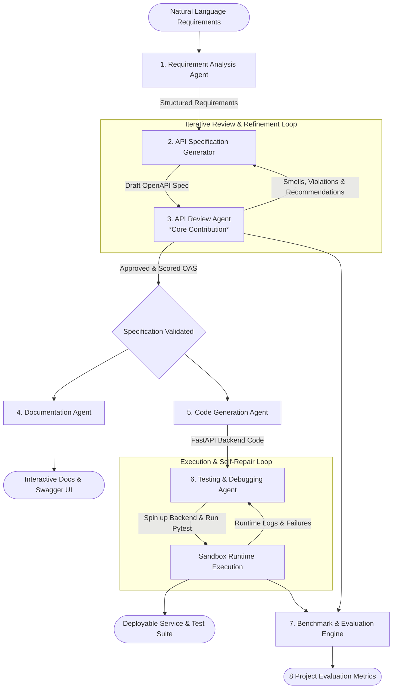

# APIForge AI

**A Multi-Agent Framework for Intelligent API Design, Automated Review, Documentation, and Testing**

[](https://www.python.org/)
[](LICENSE)
[]()

APIForge AI is a multi-agent software engineering framework that automates the API-first development lifecycle. Its primary scientific contribution is the **API Review Agent**, which evaluates and refines OpenAPI specifications (OAS 3.1) against REST architectural principles and security standards *before* backend code generation or test execution occurs.

---

## 🏛 Framework Architecture



---

## 🤖 The 6 Specialized Agents

1. **Requirement Analysis Agent**: Converts natural language software requirements into typed domain entities, fields, relationships, CRUD and custom operations, and security constraints.
2. **API Specification Generator Agent**: Synthesizes standard OpenAPI 3.1 specifications with reusable component schemas, parameter bindings, request bodies, and error models.
3. **API Review Agent *(Core Innovation)***:
   * Deterministic rule-based smell detector auditing 20+ REST/OAS rules (URI verbs, non-plural paths, missing status codes like 201/204/404/400/401, trailing slashes, sensitive query parameters).
   * LLM semantic and security auditor for domain consistency.
   * Multi-dimensional scoring engine computing the composite **API Quality Score (0–100)**.
   * Automated refiner iteratively applying remediations until the quality threshold is met.
4. **Documentation Agent**: Injects field examples, generates markdown developer manuals, and bundles standalone single-page **Swagger UI** and **Redoc** interactive HTML files.
5. **Code Generation Agent**: Compiles the validated OpenAPI specification into a clean, typed **FastAPI** backend with Pydantic v2 schemas, router modules, and an in-memory persistence store.
6. **Testing & Debugging Agent**: Derives functional Pytest suites, executes them in a sandboxed runtime, and automatically performs self-repair debugging if test failures occur.

---

## 📊 The 8 Research Performance Metrics

As defined in the project methodology, APIForge AI evaluates every generated API across 8 performance metrics:

| Metric | Target | Description |
| :--- | :---: | :--- |
| **OpenAPI Validation Accuracy** | 95–100% | Syntactic correctness against the OpenAPI 3.1 specification standard |
| **REST Design Compliance** | 100% | Degree of adherence to REST principles (plural nouns, no URI verbs, proper HTTP methods) |
| **Documentation Completeness** | 100% | Coverage of endpoint summaries, descriptions, parameters, and response schemas |
| **Security Recommendation Coverage** | 100% | Percentage of mutating and private operations protected with authentication schemes |
| **API Quality Score** | 0–100 | Weighted multi-attribute quality score computed by the Review Agent |
| **Test Case Success Rate** | 100% | Percentage of generated functional Pytest cases executed successfully |
| **Execution Reliability** | 100% | Rate of error-free, crash-free service boot and runtime test execution |
| **Error Reduction Rate** | 100% | Defect reduction achieved by reviewing and refining specifications prior to code synthesis |

---

## 🚀 Quickstart

### 1. Installation

```bash
# Clone repository
git clone <repo-url>
cd ai-project

# Create virtual environment and activate
python -m venv .venv
.venv\Scripts\activate   # On Windows
source .venv/bin/activate # On Linux/macOS

# Install package
pip install -e .
```

### 2. End-to-End API Generation (CLI)

```bash
# Generate full API service from natural language prompt
apiforge run "Design an E-Commerce Order Management API with customer auth, cart, and product inventory." --output-dir ./generated_api
```

### 3. Review Any Existing OpenAPI Specification

```bash
# Audit an OpenAPI spec for REST smells and security vulnerabilities
apiforge review ./generated_api/openapi.json

# Audit and automatically apply refiner fixes
apiforge review ./flawed_spec.json --fix --output ./fixed_spec.json
```

### 4. Run Benchmark Evaluation

```bash
# Evaluate APIForge across 4 domain test suites (E-Commerce, Healthcare, IoT, Task Management)
apiforge benchmark --suite all
```

### 5. Launch Interactive Web Dashboard

```bash
apiforge ui --port 8501
```

---

## 🧪 Running Automated Tests

```bash
pytest -v
```

---

## 📚 Project Structure

```
ai-project/
├── apiforge/
│   ├── core/
│   │   ├── state.py            # Typed Pydantic framework state
│   │   ├── llm.py              # Multi-provider LLM abstraction (Gemini/OpenAI/Mock)
│   │   └── orchestrator.py     # Master workflow pipeline orchestrator
│   ├── agents/
│   │   ├── requirement_agent.py# Requirement Analysis Agent
│   │   ├── generator_agent.py  # OpenAPI 3.1 Generator Agent
│   │   ├── review_agent/       # API Review Agent (Linter, Refiner, Scorer, Semantic)
│   │   ├── documentation_agent.py # Docs, Swagger UI & Redoc exporter
│   │   ├── codegen_agent.py    # FastAPI backend generator
│   │   └── testing_agent/      # Test Generator, Sandbox Runner & Debugger
│   ├── evaluation/
│   │   ├── metrics.py          # 8 Performance Metrics calculator
│   │   └── benchmark_runner.py # Multi-domain academic benchmark suite
│   ├── ui/
│   │   └── dashboard.py        # Streamlit interactive dashboard
│   └── cli.py                  # Typer terminal CLI
├── docs/                       # Research papers, survey, methodology
├── tests/                      # Automated test suite
└── pyproject.toml              # Build configuration
```
